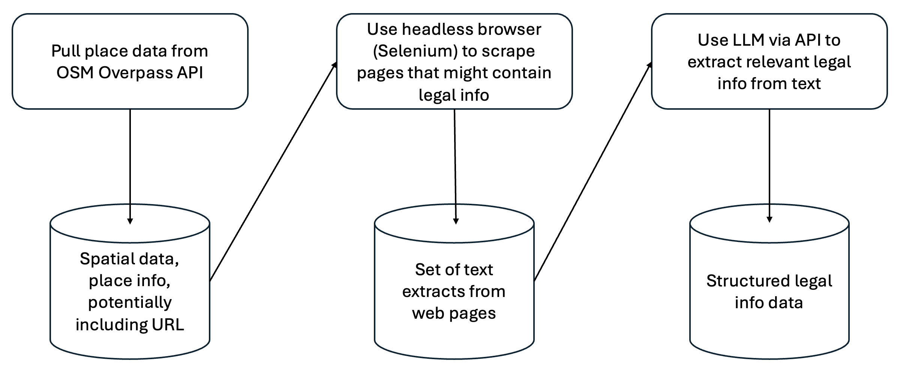
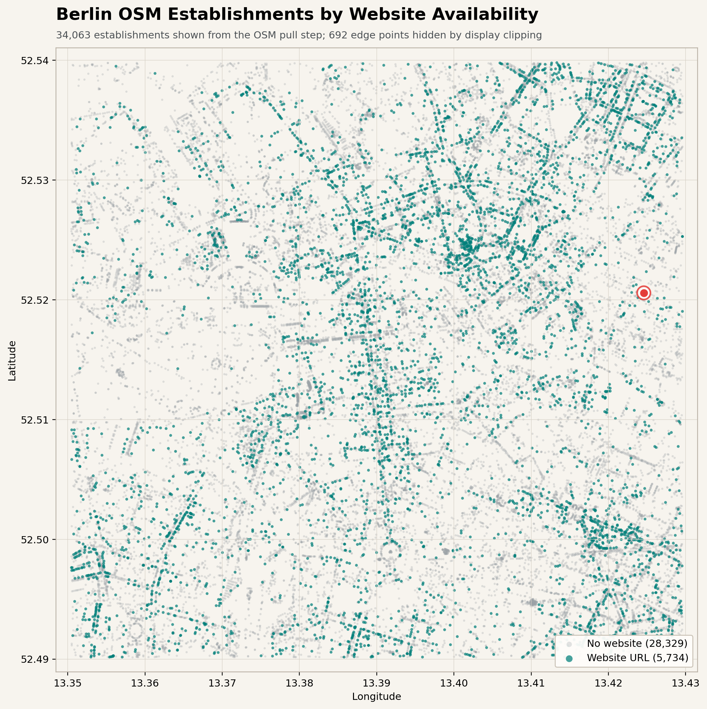

# Collect Legal Information for OpenStreetMap Establishments

This repository showcases how to collect and process unstructured data. 
Its pipeline starts with gathering OpenStreetMap establishments and ends with
structured legal-entity information from the establishments' websites.

The central question is:

> If OSM gives us a website for a shop, office, restaurant, amenity, or similar
> establishment, can we identify the legal entity responsible for that website?

The pipeline is deliberately split into steps so each stage can be inspected and
rerun without repeating all previous work. It also supports interrupted
workflows by using caches.



## Workflow

1. Pull establishments from OSM with the Overpass API.
2. Visit establishment websites with Selenium and collect pages that are likely
   to contain legal info.
3. Ask an LLM to extract conservative, structured legal information from that
   evidence.

The final generated dataset is:

```text
data/generated/osm_establishments_legal_info.csv
```

Intermediate pulled data lives in `data/pulled`. Restartable step caches live in
`data/cache`.

## Demonstration Scope

This repository is configured as a small demonstration, not a full-scale OSM
harvest.

By default, the OSM pull uses a Berlin-Mitte bounding box:

```text
south=52.49, west=13.35, north=52.54, east=13.43
```

The web scraping step then keeps the run manageable by processing only the first
25 establishments that have website URLs. The LLM extraction step works from
that scraped evidence, so the final CSV also reflects those 25 URL-bearing
establishments.

To scale the project up, adjust `BBOX` in `code/pull_osm_data.py` and the
`--limit` argument in `code/scrape_web_for_legal_info.py`.

## Setup

### pip

```sh
python3 -m venv .venv
source .venv/bin/activate
python -m pip install --upgrade pip
python -m pip install -e .
```

Then run the pipeline with:

```sh
make all
```

### uv

```sh
uv venv .venv
source .venv/bin/activate
uv sync
```

Then run the pipeline with:

```sh
make all
```

Both setup paths use `pyproject.toml` as the single dependency list.

### LLM credentials

The LLM extraction step reads environment variables from `secrets.env` in the
project root. Create this file before running `make all`:

```sh
OPENAI_API_KEY=your_api_key_here
```

You can also override the model there:

```sh
LLM_MODEL=openai/gpt-5-mini
```

`secrets.env` is ignored by Git and should not be committed.


## Make Targets

Build the final legal-info CSV:

```sh
make all
```

Build the map scatter plot featured below:

```sh
make map
```

Create a timestamped safety copy of the current data and output artifacts:

```sh
make backup
```

The backup is written to `backups/pipeline_outputs_<timestamp>/` and includes
the `data` and `output` folders. This is useful before testing a clean rebuild.

Remove only the generated map PNG:

```sh
make clean
```

Remove all reproducible data outputs and caches:

```sh
make dist-clean
```

## A Data Walkthrough

The examples below follow OSM ID `326807348`, which is highlighted by the red
dot in the map.



The gray and teal points are establishments from the OSM pull. The red dot marks
OSM ID `326807348`, the establishment used in the snippets below.

## Step 1: OSM Pull

Script:

```sh
python code/pull_osm_data.py
```

Output:

```text
data/pulled/business_places.geojson
```

The OSM pull queries business-like tags such as `shop`, `amenity`, `office`,
`craft`, `tourism`, `leisure`, and `healthcare`. Per-tag Overpass responses are
cached in `data/cache/osm`.

For this demonstration, the pull is limited to the Berlin-Mitte bounding box
defined in `code/pull_osm_data.py`.

Snippet for OSM ID `326807348`:

```json
{
  "osm_type": "node",
  "osm_id": 326807348,
  "name": "SILK Emotions",
  "website": "https://www.silk-emotions.de/",
  "business_type": "shop:hairdresser",
  "phone": "+49302414787",
  "geometry": {
    "type": "Point",
    "coordinates": [
      13.4245803,
      52.5205862
    ]
  }
}
```

## Step 2: Web Evidence Scrape

Script:

```sh
python code/scrape_web_for_legal_info.py
```

Output:

```text
data/pulled/legal_web_pages.json
```

The scraper opens each establishment website in a headless browser, follows
likely legal links such as `Impressum`, `Kontakt`, and `Datenschutz`, and stores
rendered page text. Per-OSM scrape packets are cached in
`data/cache/web_scrape`.

For this demonstration, the scraper processes only 25 establishments with URLs
by default.

Snippet for OSM ID `326807348`, keeping only the Impressum page but showing its
full captured text:

```json
{
  "osm_type": "node",
  "osm_id": "326807348",
  "name": "SILK Emotions",
  "website": "https://www.silk-emotions.de/",
  "domain": "silk-emotions.de",
  "legal_links": [
    "https://www.silk-emotions.de/impressum/",
    "https://www.silk-emotions.de/impressum",
    "https://www.silk-emotions.de/kontakt/",
    "https://www.silk-emotions.de/kontakt",
    "https://www.silk-emotions.de/ueber-uns/"
  ],
  "pages": [
    {
      "page_role": "impressum",
      "url": "https://www.silk-emotions.de/impressum/",
      "title": "Impressum - Silk Emotions - Ihr Friseur und Kosmetik Salon in Berlin - Mitte",
      "text_length": 1999,
      "text": "Impressum - Silk Emotions - Ihr Friseur und Kosmetik Salon in Berlin - Mitte Terminanfrage: 030 – 241 47 87 Start Leistungen Preisübersicht Über uns Team & Jobs Ihre Terminanfrage Impressum Datenschutzerklärung Menü Menü Impressum Anbieterkennzeichnung F & K Elegante Haarmode GmbH Weydemeyerstraße 1 10178 Berlin Tel: (030) 2414787 info@silk-emotions.de Registergericht AG Berlin – Charlottenburg HRB 58222 Steuernummer: 37/155/20193 Quellenangaben für die verwendeten Bilder und Grafiken Copyright 123rf.com: nikolayzaiarnyi Weitere Fotos erstellt durch den Fotografen …. Urheberrecht Die durch die Seitenbetreiber erstellten Inhalte und Werke auf diesen Seiten unterliegen dem deutschen Urheberrecht. Die Vervielfältigung, Bearbeitung, Verbreitung und jede Art der Verwertung außerhalb der Grenzen des Urheberrechtes bedürfen der schriftlichen Zustimmung des jeweiligen Autors bzw. Erstellers. Downloads und Kopien dieser Seite sind nur für den privaten, nicht kommerziellen Gebrauch gestattet. Soweit die Inhalte auf dieser Seite nicht vom Betreiber erstellt wurden, werden die Urheberrechte Dritter beachtet. Insbesondere werden Inhalte Dritter als solche gekennzeichnet. Sollten Sie trotzdem auf eine Urheberrechtsverletzung aufmerksam werden, bitten wir um einen entsprechenden Hinweis. Bei Bekanntwerden von Rechtsverletzungen werden wir derartige Inhalte umgehend entfernen. Leistungen Hairstyle Damen | Hairstyle Herren| Kosmetik | Pediküre | Massagen | Make up | Naturkosmetik | Onkologische Kosmetik | Zweithaar | Workshops Aktuelle Preisübersicht Kontakt SILK Emotions Friseur und Kosmetik Weydemeyerstraße 1 10178 Berlin-Mitte Tel.: 030 – 241 47 87 info@silk-emotions.de Öffnungszeiten Mo. : nach Vereinbarung, reserviert für Zweithaar-Kunden Di. bis Fr. : 8.30 -19.00 Uhr Mitglied der INTERCOIFFURE Mondial © Copyright - Silk Emotions - Ihr Friseur und Kosmetik Salon in Berlin - Mitte - Kontakt - Impressum - Datenschutzerklärung Link zu Facebook Link zu Instagram Nach oben scrollen"
    }
  ]
}
```

## Step 3: LLM Legal-Info Parse

Script:

```sh
python code/parse_legal_entities_llm.py
```

Output:

```text
data/generated/osm_establishments_legal_info.csv
```

The parser builds a curated evidence packet and asks the LLM to extract only
fields supported by the collected evidence. Per-OSM verbose JSON packets are
cached in `data/cache/llm_parse`; those packets include the provided web data,
the curated LLM input, and the LLM response.

Generated CSV row for OSM ID `326807348`:

| osm_id | name | legal_name | full_address | register_court | register_type | register_number | steuer_number | confidence |
|---|---|---|---|---|---|---|---|---|
| `326807348` | SILK Emotions | F & K Elegante Haarmode GmbH | Weydemeyerstraße 1, 10178 Berlin | Berlin-Charlottenburg | HRB | 58222 | 37/155/20193 | high |

The LLM instructions live in `code/llm_instructions.md`. They are intentionally
conservative: fields should stay empty when the evidence does not clearly
support them.

## Reruns And Caches

Each pipeline script has a rerun constant near the top of the file:

- `REPULL_DATA` in `code/pull_osm_data.py`
- `RESCRAPE_DATA` in `code/scrape_web_for_legal_info.py`
- `REPARSE_DATA` in `code/parse_legal_entities_llm.py`

By default, existing final artifacts are reused. Step caches are retained by
default as audit and restart data. Set `TEARDOWN_CACHE_FOLDER = True` in a script
if you want that script to remove its cache after a successful run.

## Why The Pipeline Is Split

The split allows to run the pipeline on large spatial areas with many 
establishments. It also makes failures easier to diagnose:

- If the final legal entity is wrong, first inspect the OSM website URL.
- If the URL is right, inspect the rendered legal evidence in
  `data/pulled/legal_web_pages.json`.
- If the evidence is right, inspect the verbose LLM cache packet in
  `data/cache/llm_parse`.
